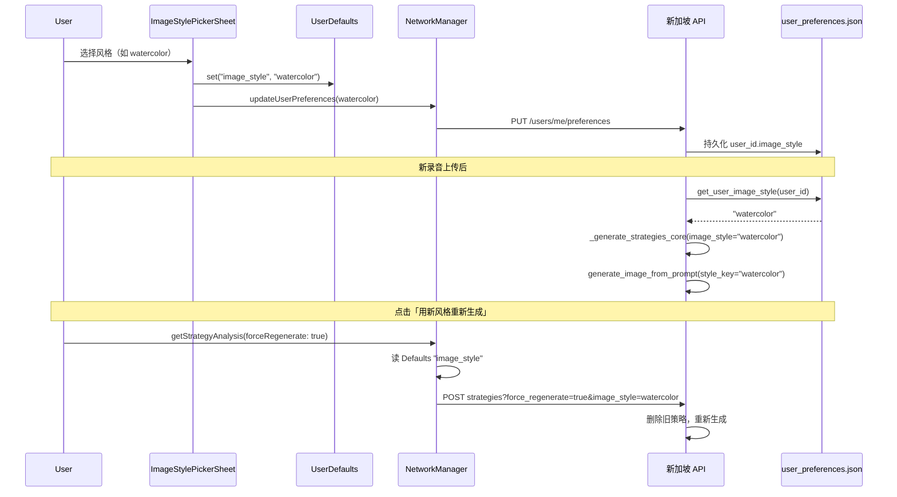

# 图片风格更换技术方案

## 一、整体架构

```mermaid
flowchart TB
    subgraph Client [iOS 客户端]
        TaskListHeader[任务列表 Header]
        Menu[Menu 菜单]
        StylePicker[ImageStylePickerSheet]
        StrategyView[StrategyAnalysisView]
        RegenBtn["用新风格重新生成" 按钮]
        
        TaskListHeader --> Menu
        Menu -->|"图片风格"| StylePicker
        Menu -->|"更换皮肤"| Placeholder[占位]
        StrategyView --> RegenBtn
    end
    
    subgraph Storage [本地存储]
        UserDefaults[UserDefaults image_style]
    end
    
    subgraph Server [服务端]
        PrefAPI[PUT /users/me/preferences]
        StrategyAPI[POST /tasks/sessions/{id}/strategies]
        UserPrefFile[user_preferences.json]
        GenerateCore[_generate_strategies_core]
        ImageGen[generate_image_from_prompt]
        Gemini[Gemini 2.5 Flash Image]
        OSS[阿里云 OSS]
    end
    
    StylePicker -->|选择并保存| UserDefaults
    StylePicker -->|Task 异步| PrefAPI
    PrefAPI --> UserPrefFile
    
    RegenBtn -->|force_regenerate + image_style| StrategyAPI
    StrategyAPI --> GenerateCore
    GenerateCore -->|读取 image_style| UserPrefFile
    GenerateCore -->|style_key| ImageGen
    ImageGen --> Gemini
    ImageGen --> OSS
```

## 二、客户端（iOS）

### 2.1 入口与 UI

**任务列表页**（`Models.swift/WorkSurvivalGuide/WorkSurvivalGuide/Views/TaskListView.swift`）
- 在 Header 右侧，设备按钮旁有 `Menu`（ellipsis.circle）
- 菜单项：「图片风格」「更换皮肤」（皮肤为占位）
- 点击「图片风格」弹出 `ImageStylePickerSheet`

**策略详情页**（`Models.swift/WorkSurvivalGuide/WorkSurvivalGuide/Views/StrategyAnalysisView_Updated.swift`）
- 技能分析区域有「用新风格重新生成」按钮
- 点击后调用 `loadStrategyAnalysis(forceRegenerate: true)`，使用当前选择的风格重新生成策略图片

### 2.2 风格数据

**模型**（`Models.swift/WorkSurvivalGuide/WorkSurvivalGuide/Models/ImageStyle.swift`）
- `ImageStyle`：id, name, nameEn, promptKeywords, accentColor
- `ImageStylePresets.all`：15 种风格（宫崎骏 + 14 种）
- id 与服务端 `IMAGE_STYLE_MAP` 的 key 一一对应

| id           | 中文名       |
| ------------ | ------------ |
| ghibli       | 宫崎骏风格   |
| shinkai      | 新海诚风格   |
| pixar        | 皮克斯风格   |
| cyberpunk    | 赛博朋克风   |
| watercolor   | 水彩插画风   |
| ukiyoe       | 浮世绘风格   |
| line_art     | 黑白线稿风   |
| steampunk    | 蒸汽朋克风   |
| pop_art      | 波普艺术风   |
| scandinavian | 北欧插画风   |
| retro_manga  | 复古昭和漫画 |
| oil_painting | 油画质感     |
| pixel        | 像素风       |
| chinese_ink  | 中国水墨风   |
| storybook    | 童话绘本风   |

### 2.3 选择与同步

**选择流程**（`Models.swift/WorkSurvivalGuide/WorkSurvivalGuide/Views/ImageStylePickerSheet.swift`）
1. 用户选择某一风格 → `selectedStyleId = style.id`
2. 写入本地：`UserDefaults.standard.set(style.id, forKey: "image_style")`
3. 异步调用：`NetworkManager.shared.updateUserPreferences(imageStyle: style.id)`

**偏好同步**（`Models.swift/WorkSurvivalGuide/WorkSurvivalGuide/Services/NetworkManager.swift` 第 551–584 行）
- `PUT /api/v1/users/me/preferences`，body：`{"image_style": "xxx"}`
- 需 JWT；Mock 模式或无有效 Token 时跳过

### 2.4 强制重新生成

**调用逻辑**（`Models.swift/WorkSurvivalGuide/WorkSurvivalGuide/Services/NetworkManager.swift` 第 602–606 行）
- `forceRegenerate == true` 时，从 `UserDefaults` 读取 `image_style`（默认 ghibli）
- 请求：`POST {writeBaseURL}/tasks/sessions/{id}/strategies?force_regenerate=true&image_style={encoded}`

## 三、服务端（Python）

### 3.1 风格映射

**IMAGE_STYLE_MAP**（`main.py` 第 648–664 行）
- 将 style_key 映射为 Gemini 图片生成的前缀 prompt
- 示例：`"watercolor"` → `"水彩插画风格，晕染边缘、透明层次、留白笔触，清新自然，类似绘本插画。"`
- 未命中时回退到 `ghibli`

### 3.2 用户偏好存储

**持久化**（`utils/user_preferences.py`）
- 路径：`~/gemini-audio-service/data/user_preferences.json`
- 结构：`{ "user_id": { "image_style": "watercolor" } }`
- `get_user_image_style(user_id)`：读取当前风格
- `set_user_image_style(user_id, image_style)`：写入并保存

**API**（`main.py` 第 1234–1257 行）
- `PUT /api/v1/users/me/preferences`
- body：`UserPreferencesUpdate`，含 `image_style`
- 调用 `set_user_image_style` 持久化

### 3.3 风格来源（两条路径）

| 场景                 | 风格来源                                        |
| -------------------- | ----------------------------------------------- |
| 新录音自动生成策略   | `get_user_image_style(user_id)`，无则默认 ghibli |
| 手动「用新风格重新生成」 | 请求参数 `image_style`（来自客户端 UserDefaults） |

### 3.4 策略生成与图片调用

**策略接口**（`main.py` 第 2819–2948 行）
- `POST /api/v1/tasks/sessions/{session_id}/strategies`
- Query：`force_regenerate`、`image_style`
- 有已存在策略且未 force 时，直接返回 DB 数据
- 否则调用 `_generate_strategies_core(session_id, user_id, transcript, db, image_style=image_style)`

**图片生成**（`main.py` 第 668–847 行，style_key 使用处约第 2578 行）
- `generate_image_from_prompt(..., style_key=image_style)` 在策略技能执行阶段被调用
- 非 ghibli 时：移除技能 prompt 中的宫崎骏前缀，用 `re.sub` 兜底
- 最终 prompt = `style_prefix + ref_desc + prompt_body`
- 调用 Gemini 2.5 Flash Image，生成后上传 OSS

### 3.5 风格冲突处理

技能 prompt 默认带宫崎骏描述（如「宫崎骏吉卜力动画风格，温暖自然色调。」）。非宫崎骏风格时需避免冲突：
- 按多种前缀尝试 strip
- 正则：`re.sub(r"^宫崎骏[^。]*。?", "", prompt_body)`

## 四、数据流小结



## 五、关键文件索引

| 模块       | 文件路径                                                                 |
| ---------- | ------------------------------------------------------------------------ |
| 客户端风格模型 | `Models.swift/WorkSurvivalGuide/WorkSurvivalGuide/Models/ImageStyle.swift` |
| 风格选择弹窗   | `Models.swift/WorkSurvivalGuide/WorkSurvivalGuide/Views/ImageStylePickerSheet.swift` |
| 任务列表入口   | `Models.swift/WorkSurvivalGuide/WorkSurvivalGuide/Views/TaskListView.swift` 第 132–148 行 |
| 重新生成按钮   | `Models.swift/WorkSurvivalGuide/WorkSurvivalGuide/Views/StrategyAnalysisView_Updated.swift` |
| 偏好同步     | `Models.swift/WorkSurvivalGuide/WorkSurvivalGuide/Services/NetworkManager.swift` 第 551–584、602–606 行 |
| 风格映射     | `main.py` 第 648–664 行                                                   |
| 图片生成     | `main.py` 第 668–847 行，style_key 使用处约第 2578 行                       |
| 用户偏好 API | `main.py` 第 1234–1257 行                                                 |
| 偏好存储     | `utils/user_preferences.py`                                              |
